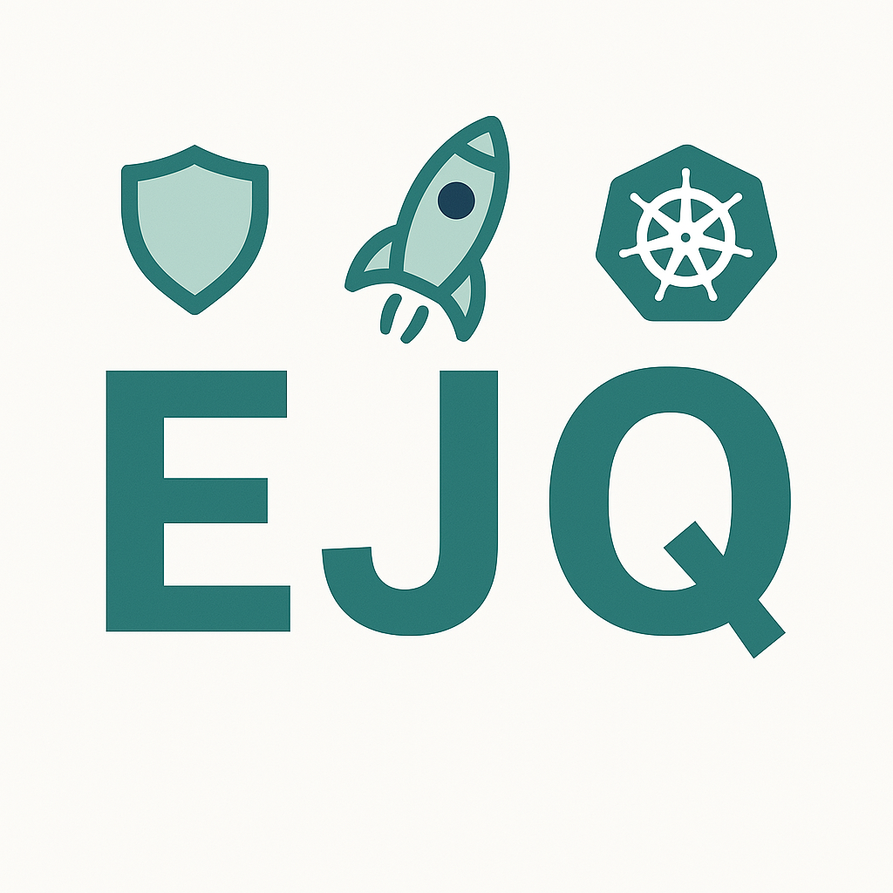

 

 
I'm incredibly excited to finally share something I've been pouring a lot of passion into lately. For a while now, I've been thinking about the best way to share the practical, hands-on Java knowledge that I believe is so critical for all of us in the developer community. And I think I've found it. I'd like to personally invite you to my new Substack: <a href="https://myfear.substack.com" target="_blank">Enterprise Java and Quarkus</a>.&nbsp;

 This is more than just a blog; I see it as my new flagship project, a dedicated space where we can explore the ins and outs of modern Java development together. My goal is simple: to provide you with a steady stream of small, practical, and immediately useful examples. I've always believed that the best way to learn is by doing, by getting your hands dirty with code that solves a real problem. No long, winding theories, just straight-to-the-point, actionable content.&nbsp;

 I've been writing about a bunch of different topics, and you can see a complete list of the articles I've published so far right here on <a href="https://github.com/myfear/ejq_substack_articles" target="_blank">GitHub</a>. Make sure to give it a start or even contribute by suggesting a new topic or idea!&nbsp;

  

 The articles fall into a few key categories that I think are essential for today's Java developer:&nbsp;

 <ul style="text-align: left;">
  <li>AI &amp; LLM Integration: I look into the fascinating world of AI and see how we can integrate it into our Java applications.&nbsp;</li>
  <li>Data Processing &amp; Integration: A look at practical ways to handle and integrate data in our projects.&nbsp;</li>
  <li>Security &amp; Error Handling:&nbsp;Covers the crucial aspects of making our applications secure and robust.&nbsp;</li>
  <li>Application Architecture &amp; Patterns: An exploration of different architectural patterns to build scalable and maintainable systems.&nbsp;</li>
 </ul>

 For me, it's all about continuous learning. The Java landscape is constantly evolving, and staying on top of it can feel overwhelming. My hope is that "Enterprise Java and Quarkus" will be your companion on this journey, a place you can turn to for quick, practical insights that will help you grow as a developer.&nbsp;

  

 I'm putting a lot of heart into this, and I'd be thrilled if you would join me. The best way to stay up-to-date is to subscribe. You'll get every new article delivered directly to your inbox, hot off the press. <a href="https://myfear.substack.com" target="_blank">Click here to subscribe and join the community!</a> I can't wait to see you there and to continue our learning journey together. As always, thank you for being a reader of my blog, and I'm excited for this next chapter. Let's build some cool stuff!

