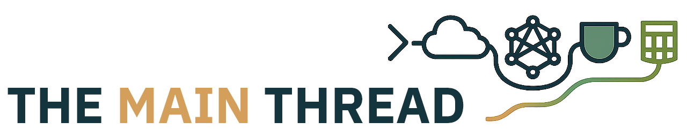

 

 
It’s been half a year since I launched <em>Enterprise Java and Quarkus</em> on Substack. What started as an experiment in long-form writing quickly turned into something more meaningful: a space where I could slow down, dive deep, and connect with Java developers who still believe in the power of well-engineered, open systems.

If you've followed along, thank you. You’ve read, commented, shared, and nudged me to keep publishing through weekends, deadlines, and even a career shift.

This post is both a retrospective and a quiet announcement. <em>Enterprise Java and Quarkus</em> isn’t going away but it’s evolving. There’s a new thread forming. More on that in a moment.

 

<h2>Looking Back: A Java Runtime, A Cup of Coffee, and 38 Deep Dives</h2>

When I started this newsletter, the goal was simple: show how Quarkus isn’t just another framework. It’s the next phase of enterprise Java. In a world chasing Python notebooks and GPU clusters, Quarkus reminds us that fast, portable, predictable Java still matters. Especially when you pair it with AI, containers, and decades of business logic that <em>just works</em>.

Since January, I've published over three dozen hands-on tutorials. Here's a sample of what we’ve built together:

<ul>
 <li>A <strong>resilient file upload system</strong> that retries and recovers without blinking.</li>
 <li>A <strong>secure diary app</strong> that encrypts every personal thought using Bouncy Castle.</li>
 <li>A <strong>smart API gateway</strong> with feature flags, key rotation, and rate limiting.</li>
 <li>A <strong>real-time voting system</strong> using WebSockets and PostgreSQL.</li>
 <li>AI-powered tools like a <strong>crossword puzzle generator</strong>, a <strong>PDF risk analyzer</strong>, and a <strong>local-first memory system</strong> using <code>pgvector</code>.</li>
</ul>

<a href="https://github.com/myfear/ejq_substack_articles" rel="noopener" target="_blank">See the full list on GitHub →</a>

These projects weren’t just technical exercises. They were my way of exploring real pain points I’ve heard in countless enterprise dev meetings: “How do I modernize without rewriting everything?” “How do I bring AI into the stack without losing control?” “Can we finally make Java fun again?”

Quarkus gave me the language. You gave me the audience. And somewhere in between, this became less of a side project and more of a pulse.

 

<h2>An Unexpected Pivot</h2>

Around mid-year, life nudged me forward in ways I hadn’t planned. I transitioned from Red Hat to IBM Research. I stepped deeper into AI and language models. I found myself thinking more about the long game—not just the next tutorial, but what’s really changing under our feet.

That’s when <em>The Main Thread</em> was born.

 

<h2>Introducing The Main Thread</h2>

<a href="https://www.the-main-thread.com/about" rel="noopener" target="_blank">The Main Thread</a> is my new home for deeper, more strategic thinking. It’s still about Java, still grounded in open source—but it zooms out. It explores how software is built, used, misused, and sometimes weaponized in today’s world.

It’s for the CTO who wonders what “AI-powered” really means in procurement slides. 
  It’s for the architect trying to draw boundaries in a world of model weights and vector stores. 
  It’s for the engineer who’s tired of watching good software get rebranded every two years.

If <em>Enterprise Java and Quarkus</em> is where we build, <em>The Main Thread</em> is where we reflect. It’s where we ask better questions before we write the next line of code.

 

<h2>So, What Happens Now?</h2>

The Quarkus content won’t stop. I’ll keep writing hands-on tutorials, publishing updates to the GitHub repo, and sharing techniques for AI-infused Java applications. If you’re already subscribed to the Substack, you’ll continue getting that content as always.

But I’ll also be writing more on <em>The Main Thread</em>. The posts will be more personal, more opinionated, and occasionally uncomfortable.&nbsp;

<h2>Thank You</h2>

If you’ve ever read, commented, or quietly bookmarked one of my articles, I want you to know it mattered. This space has been an anchor during a time of change—professionally, intellectually, and even emotionally.

And if you’re joining me now, welcome. Java is still alive. It’s evolving. And we’re going to keep pushing it together.

<strong>See you on the thread.</strong>

— Markus
